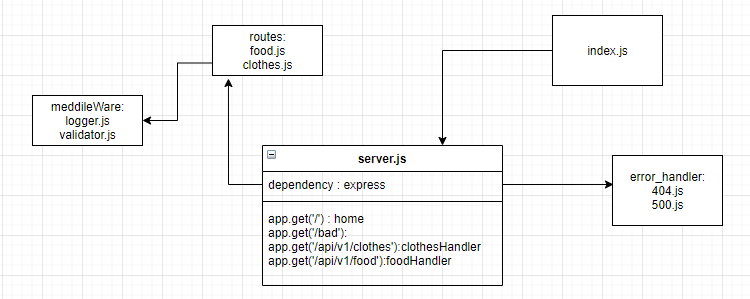

# basic-express-server

## Deployment Test
Author: Anwar Abbass
[tests report]()
[heroku](https://basic-express-server-anwar.herokuapp.com/)
## Setup
`.env` requirements
`dotenv`  requirements
`express`  requirements
`jest`  requirements
`supertest`  requirements
PORT - Port Number

## Running the app
npm start
- Endpoint: / 
Returns Object

{
  'you are in the home page'
}

- Endpoint: /bad
Returns Object

{
  'SOMETHING IS ERROR'
}


## Tests
Unit Tests: npm run test

--------------------|---------|----------|---------|---------|-------------------
File                | % Stmts | % Branch | % Funcs | % Lines | Uncovered Line #s
--------------------|---------|----------|---------|---------|-------------------
All files           |   93.75 |      100 |      80 |   96.77 |
 src                |      90 |      100 |      60 |   94.74 |
  server.js         |      90 |      100 |      60 |   94.74 | 33
 src/error-handlers |     100 |      100 |     100 |     100 |
  404.js            |     100 |      100 |     100 |     100 |
  500.js            |     100 |      100 |     100 |     100 |
 src/middleware     |     100 |      100 |     100 |     100 |
  logger.js         |     100 |      100 |     100 |     100 |
  validator.js      |     100 |      100 |     100 |     100 |
--------------------|---------|----------|---------|---------|-------------------
Test Suites: 3 passed, 3 total
Tests:       7 passed, 7 total
Snapshots:   0 total
Time:        62.076 s

Lint Tests: npm run lint
```
[nodemon] starting `node index.js`
listen on port 3000
```

UML

